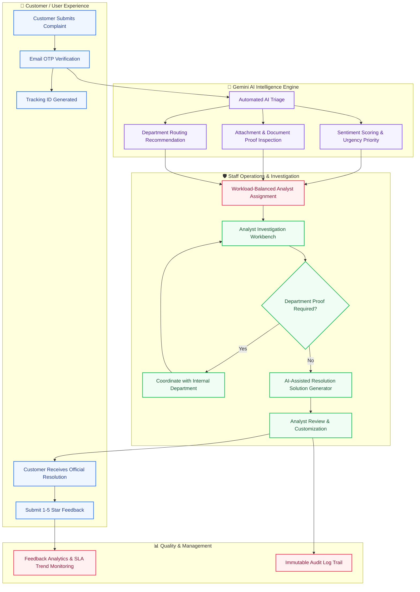
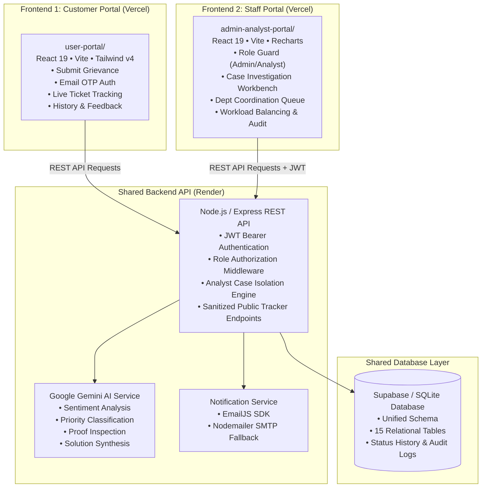
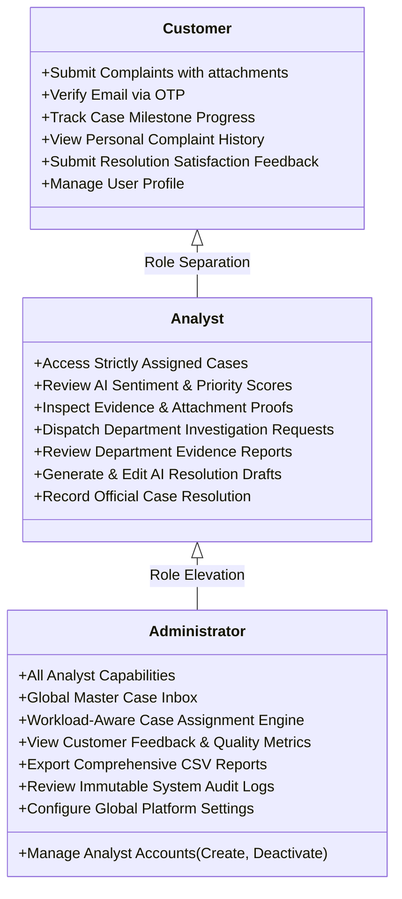
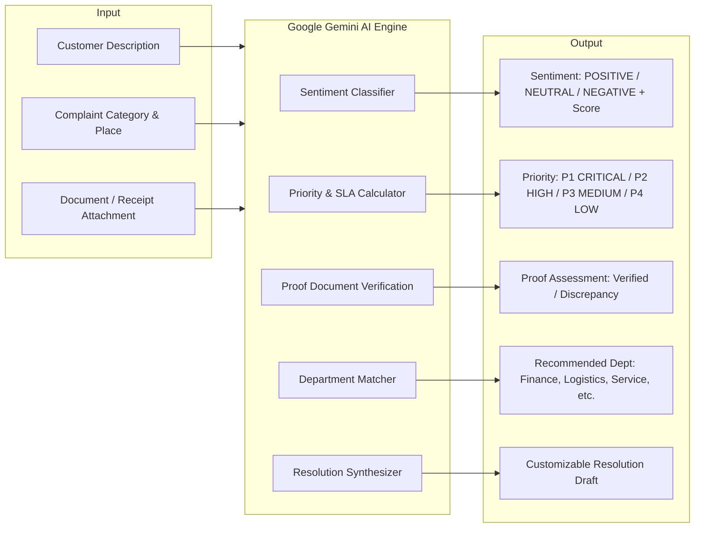
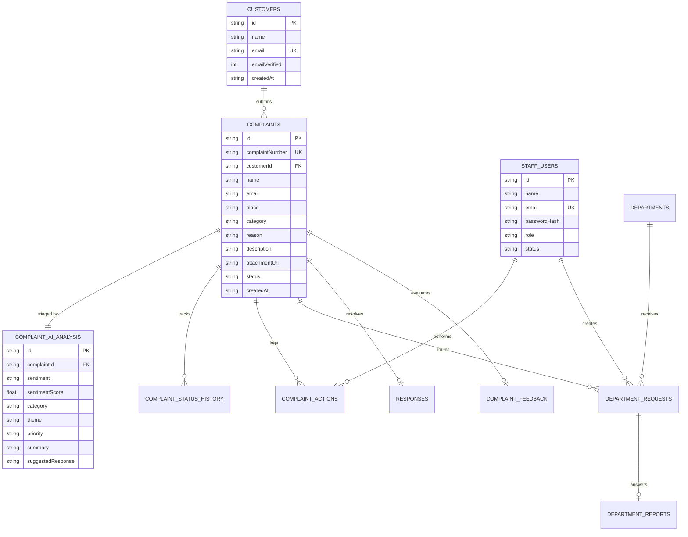

<div align="center">

# 🔄 LOOP — AI-Powered Grievance & Customer Resolution Platform

### *Transforming customer complaints into intelligent, transparent, and trackable resolutions.*

[](https://react.dev/)
[](https://vitejs.dev/)
[](https://tailwindcss.com/)
[](https://nodejs.org/)
[](https://expressjs.com/)
[](https://ai.google.dev/)
[](https://supabase.com/)
[](https://vercel.com/)
[](https://render.com/)

<br />

---

### 🌐 Live Production Deployments

| Component | Target Role | Live URL | Platform |
|:---|:---|:---|:---|
| 👤 **Customer / User Portal** | Customers & Complainants | [**user-portal-w2ol.vercel.app**](https://user-portal-w2ol.vercel.app/) |  |
| 🛡️ **Admin & Analyst Portal** | Case Analysts & System Admins | [**admin-analyst-portal.vercel.app**](https://admin-analyst-portal.vercel.app/) |  |
| ⚙️ **Shared Backend REST API** | Core Intelligence API Service | [**loop-backend-ahtf.onrender.com**](https://loop-backend-ahtf.onrender.com/api/health) |  |

---

</div>

<br />

## 📖 What is LOOP?

**LOOP** is an enterprise-grade grievance intelligence and customer resolution platform architected to eliminate the black box of customer support. Rather than acting as a static complaint form, LOOP serves as an **end-to-end operational operating system** linking customers, frontline analysts, system administrators, and internal departments into a unified, transparent resolution lifecycle.

Powered by **Google Gemini AI**, LOOP automatically triages incoming grievances, extracts emotional sentiment, predicts urgency and SLA priority, verifies attached receipt or document proofs, recommends departmental investigation routing, and assists analysts in generating formal, empathetic resolutions.

```
Customer Submits Grievance (with Proof) ➔ Email OTP Verification ➔ AI Triage & Sentiment Analysis 
➔ Analyst Case Workbench ➔ Department Investigation Coordination ➔ Solution Formulation 
➔ Official Resolution Dispatch ➔ Customer Satisfaction Feedback ➔ Executive Quality Analytics
```

---

## 🔄 End-to-End Resolution Lifecycle



---

## 🏛️ System Architecture

LOOP is organized into **two independent frontend applications** that communicate with a single **shared Node.js/Express backend** and a **unified relational database**:



---

## 🖥️ The Two Independent Frontends

LOOP provides strict architectural separation between customer-facing interactions and internal staff operations.

```
LOOP/
├── user-portal/              # Dedicated Customer Portal (Port 3000 / Vercel)
└── admin-analyst-portal/     # Dedicated Staff Enterprise Workbench (Port 3002 / Vercel)
```

| Dimension | 👤 Customer Portal (`user-portal`) | 🛡️ Admin & Analyst Portal (`admin-analyst-portal`) |
|:---|:---|:---|
| **Primary Audience** | Public Customers & Complainants | Case Analysts, Supervisors & System Admins |
| **Live URL** | [**user-portal-w2ol.vercel.app**](https://user-portal-w2ol.vercel.app/) | [**admin-analyst-portal.vercel.app**](https://admin-analyst-portal.vercel.app/) |
| **Theme / Design** | Clean Glassmorphic Light Theme | Sleek Dark Mode Enterprise Workbench |
| **Authentication** | Instant Passwordless Email OTP | Role-based JWT Auth + OTP Password Reset |
| **Complaint Handling** | Filing complaints with document proofs | Triage, investigation, department requests |
| **Tracking** | Transparent visual milestone progress | Full operational lifecycle controls |
| **Case Assignment** | ❌ None (Completely Hidden) | ✅ Workload-balanced analyst assigner |
| **AI Visibility** | Sanitized resolution output only | Full sentiment score, priority & AI reasoning |
| **Internal Data** | ❌ Zero access to staff names or notes | ✅ Full audit trail & internal collaboration notes |
| **Analytics** | Personal complaint count & status | Enterprise SLA velocity, sentiment & reports |

---

## 👥 Role-Based Access Control (RBAC)

LOOP enforces a three-tier permission model across both the user interface and backend authorization middleware:



### 🔒 Analyst Case Isolation Engine
To prevent operational cross-talk and maintain strict organizational confidentiality:
- **Analyst A** can **only** query and modify complaints specifically assigned to their account (`usr_analyst_01`).
- **Analyst B** attempting to access Complaint #104 assigned to Analyst A receives an immediate `403 Forbidden` response from the backend.
- **Administrators** retain supervisory oversight to rebalance workloads and monitor systemic bottleneck trends.

---

## 🤖 AI & Intelligence Engine (Google Gemini)

LOOP integrates **Google Gemini AI** (`@google/generative-ai`) directly into the backend processing pipeline to transform raw, unstructured grievance text into structured, actionable intelligence.

```
Raw Grievance & Attachment ➔ Gemini Multi-Attribute Analysis ➔ Structured Decision Matrix
```



### Key AI Pipeline Capabilities:
1. **Automated Triage & Categorization**: Analyzes natural language descriptions to categorize into *Product, Service, Payment, Delivery, Technical Issue, Billing, or Account*.
2. **Sentiment Analysis & Score**: Evaluates user emotion (e.g., *Negative 94%*) to flag critical distress early.
3. **Priority & Urgency Matrix**: Categorizes severity into `CRITICAL (P1)`, `HIGH (P2)`, `MEDIUM (P3)`, or `LOW (P4)` based on financial impact, safety, or legal implications.
4. **Receipt & Proof Document Verification**: Checks uploaded attachments against stated complaint reasons to evaluate evidence credibility.
5. **Department Routing Recommendation**: Recommends the appropriate internal department with justifiable reasoning.
6. **Explicit Solution Formulation**: Synthesizes formal, empathetic resolution responses that analysts can customize before customer dispatch.

---

## 🌟 Core Features Grid

### 🎫 Intelligent Complaint Management
- **Multi-Format Attachment Proofs**: Upload PNG, JPG, or PDF receipts (up to 10MB) with thumbnail preview and lightbox modal.
- **Real-Time Visual Tracker**: Step-by-step resolution timeline with live status indicators (`Submitted` ➔ `In Progress` ➔ `Resolved`).
- **Filterable Case Inbox**: Multi-variable search by ID, customer name, email, priority, sentiment, and assignment.

### 🏢 Department Investigation Coordination
- **Inter-Department Requests**: Analysts can route formal evidence requests to internal units (*Finance, Logistics, Legal, QA, Field Ops*).
- **Structured Findings Reports**: Departments submit findings, evidence logs, and recommendations back to the analyst workbench.

### ⚖️ Workload-Aware Case Assignment Engine
- **Capacity Balancing**: Real-time capacity indicator displaying active caseload and critical ticket distribution per analyst.
- **Recommendation Engine**: Automatically highlights analysts with the lowest active caseload to maintain SLA velocity.

### 📊 Analytics & Reporting
- **Interactive Visualizations**: Category volume charts, sentiment trends, priority distribution, and SLA resolution rate counters powered by Recharts.
- **One-Click CSV Export**: Instant export of filtered operational complaint data for executive auditing and external reporting.

### 💬 Closed-Loop Feedback & Quality Control
- **Customer Satisfaction Ratings**: 1 to 5 stars rating system with resolution completeness verification (*Yes / Partially / No*).
- **Admin Feedback Dashboard**: Aggregated satisfaction averages, promoter distribution, and actionable feedback comment streams.

---

## 🛡️ Security & Privacy Architecture

```
┌──────────────────────────────────────────────────────────────────────────────────┐
│                         SECURITY & PRIVACY GUARANTEES                             │
├──────────────────────────────────────────────────────────────────────────────────┤
│  ✅ Zero Secrets in Frontend: API keys & Gemini secrets stay in backend .env     │
│  ✅ Public Tracking Data Sanitization: Strips internal staff IDs & notes        │
│  ✅ JWT Token Authentication: Secure RS256/HS256 signed bearer authorization     │
│  ✅ Role-Based Middleware: Route guards for CUSTOMER, ANALYST, and ADMIN        │
│  ✅ Analyst Caseload Isolation: Backend-enforced SQL query boundaries            │
│  ✅ Bcrypt Password Hashing: 10-round salted hash for staff credentials          │
│  ✅ Ephemeral OTP Lifecycles: Time-bounded verification codes with auto-expiry   │
└──────────────────────────────────────────────────────────────────────────────────┘
```

---

## 💻 Technology Stack

```
                                     LOOP STACK
 ┌──────────────────────┬──────────────────────┬──────────────────────┬──────────────────────┐
 │       FRONTEND       │       BACKEND        │       DATABASE       │    AI & SERVICES     │
 ├──────────────────────┼──────────────────────┼──────────────────────┼──────────────────────┤
 │ • React 19.0         │ • Node.js 18+        │ • Supabase Cloud     │ • Google Gemini AI   │
 │ • Vite 6.0           │ • Express 4.19       │ • SQLite (Local sync)│ • EmailJS Browser    │
 │ • Tailwind CSS v4    │ • JWT (jsonwebtoken) │ • 15 Relational tbls │ • Nodemailer SMTP    │
 │ • React Router DOM 7 │ • Bcrypt.js          │ • Foreign key checks │ • Vercel (Frontend)  │
 │ • Lucide React Icons │ • CORS Middleware    │ • Status audit logs  │ • Render (Backend)   │
 │ • Recharts 2.15      │ • Dotenv             │                      │                      │
 └──────────────────────┴──────────────────────┴──────────────────────┴──────────────────────┘
```

---

## 🔌 API & Endpoint Architecture

The shared backend (`https://loop-backend-ahtf.onrender.com/api`) exposes clean RESTful endpoints:

```
Customer Portal ──┐
                  ├───► Shared Express REST API ────► SQLite / Supabase Database
Staff Portal ─────┘
```

### Key API Endpoint Groups

<details>
<summary><b>🔐 Authentication Endpoints (<code>/api/auth</code>)</b></summary>

| Method | Endpoint | Access | Purpose |
|:---|:---|:---|:---|
| `POST` | `/api/auth/customer-login` | Public | Request instant 6-digit login OTP |
| `POST` | `/api/auth/customer-verify` | Public | Verify customer OTP & issue Customer JWT |
| `POST` | `/api/auth/login` | Public | Staff (Admin / Analyst) credential login |
| `POST` | `/api/auth/forgot-password` | Public | Dispatch staff password reset OTP |
| `POST` | `/api/auth/reset-password` | Public | Reset staff password with verified OTP |
| `POST` | `/api/auth/register-analyst` | Admin | Provision a new analyst staff account |

</details>

<details>
<summary><b>🎫 Complaint & Tracking Endpoints (<code>/api/complaints</code>)</b></summary>

| Method | Endpoint | Access | Purpose |
|:---|:---|:---|:---|
| `POST` | `/api/complaints` | Public / User | Submit a new grievance with attachments |
| `GET` | `/api/complaints/track` | Public | Query sanitized case tracking information |
| `GET` | `/api/user/complaints` | Customer | Fetch submitted complaints for logged-in user |
| `GET` | `/api/staff/complaints` | Staff | Fetch operational complaints (filtered by role) |
| `GET` | `/api/staff/complaints/:id` | Staff | Get complete complaint investigation data |
| `POST` | `/api/staff/complaints/:id/action` | Staff | Record analyst investigation action notes |
| `POST` | `/api/staff/complaints/:id/department-request` | Staff | Dispatch department coordination request |
| `POST` | `/api/staff/complaints/:id/generate-solution` | Staff | Trigger Gemini explicit solution formulation |
| `POST` | `/api/staff/complaints/:id/response` | Staff | Finalize case resolution & dispatch email |

</details>

<details>
<summary><b>🏢 Department & Feedback Endpoints</b></summary>

| Method | Endpoint | Access | Purpose |
|:---|:---|:---|:---|
| `GET` | `/api/departments` | Staff | Fetch list of active coordination departments |
| `GET` | `/api/departments/queue` | Staff | View pending investigation queues |
| `POST` | `/api/staff/department-requests/:id/report` | Staff | Submit departmental investigation report |
| `POST` | `/api/feedback/submit` | Public / User | Record customer satisfaction rating & review |
| `GET` | `/api/feedback/insights` | Admin | View customer feedback metrics & ratings |
| `GET` | `/api/reports` | Staff | Generate aggregate volume & SLA analytics |

</details>

<details>
<summary><b>🛡️ Administration Endpoints (<code>/api/admin</code>)</b></summary>

| Method | Endpoint | Access | Purpose |
|:---|:---|:---|:---|
| `GET` | `/api/admin/users` | Admin | List all staff users and workload capacities |
| `POST` | `/api/admin/users` | Admin | Create and provision a new staff user |
| `PATCH` | `/api/admin/users/:id` | Admin | Update user details or toggle active status |
| `DELETE` | `/api/admin/users/:id` | Admin | Deactivate/remove a staff account |
| `POST` | `/api/admin/complaints/:id/assign` | Admin | Assign or reassign complaint to an analyst |
| `GET` | `/api/admin/audit-logs` | Admin | Fetch chronological system audit trail |
| `GET` | `/api/admin/settings` | Admin | Query platform configuration settings |

</details>

---

## 🗄️ Database Schema & Entities

LOOP utilizes a normalized relational schema synchronized between a local SQLite database and cloud Supabase tables:



---

## 📁 Repository Directory Structure

```
LOOP/
├── user-portal/                      # FRONTEND 1: Dedicated Customer Application
│   ├── src/
│   │   ├── components/               # Navbar, Footer, StatusBadge
│   │   ├── context/                  # UserAuthContext (Customer session & email OTP)
│   │   ├── pages/                    # 11 Customer-Facing Views
│   │   │   ├── LandingPage.jsx       # Public showcase & feature overview
│   │   │   ├── ComplaintFormPage.jsx # Grievance filing with proof upload
│   │   │   ├── EmailVerifyPage.jsx   # 2.5-min OTP countdown verification
│   │   │   ├── ComplaintSuccessPage.jsx # Ticket confirmation with copyable ID
│   │   │   ├── TrackComplaintPage.jsx   # Live milestone tracker & official response
│   │   │   ├── UserLoginPage.jsx     # Customer email OTP login
│   │   │   ├── UserRegisterPage.jsx  # Customer signup
│   │   │   ├── UserDashboardPage.jsx # Personal complaint status cards
│   │   │   ├── ComplaintListPage.jsx # Complete filterable grievance history
│   │   │   ├── UserFeedbackPage.jsx  # 1-5 stars resolution satisfaction form
│   │   │   └── UserProfilePage.jsx   # Customer verified profile
│   │   ├── services/                 # api.js (Customer client), emailjsService.js
│   │   ├── App.jsx                   # Customer routing pipeline
│   │   ├── main.jsx                  # React 19 entry point
│   │   └── index.css                 # Tailwind v4 light theme styles
│   ├── package.json                  # Independent customer portal package
│   ├── vite.config.js                # Port 3000 config with backend proxy
│   └── .env.example                  # Safe public environment template
│
├── admin-analyst-portal/              # FRONTEND 2: Staff Enterprise Workbench
│   ├── src/
│   │   ├── components/               # StaffHeader, StaffSidebar (responsive drawer), Badges
│   │   ├── context/                  # AuthContext (JWT bearer tokens & role guard)
│   │   ├── pages/                    # 10 Staff & Administration Views
│   │   │   ├── StaffLoginPage.jsx    # Dual-tab login (Analyst / Admin) + OTP reset
│   │   │   ├── StaffDashboardPage.jsx# Live operational KPIs & SLA velocity
│   │   │   ├── ComplaintInboxPage.jsx# Master case inbox with multi-filters & assigner
│   │   │   ├── ComplaintDetailPage.jsx# Investigation workbench & AI solution generator
│   │   │   ├── DepartmentCoordinationPage.jsx # Inter-department requests & queues
│   │   │   ├── StaffAnalyticsPage.jsx# Interactive volume & sentiment charts
│   │   │   ├── StaffReportsPage.jsx  # CSV report exporter
│   │   │   ├── FeedbackInsightsPage.jsx # Admin customer satisfaction metrics
│   │   │   ├── UserManagementPage.jsx# Admin staff provisioning & capacity view
│   │   │   └── SettingsPage.jsx      # Audit logs & platform settings
│   │   ├── services/                 # api.js (Staff & Admin REST client)
│   │   ├── utils/                    # csvExporter.js
│   │   ├── App.jsx                   # Role-guarded routing pipeline
│   │   ├── main.jsx                  # React 19 entry point
│   │   └── index.css                 # Tailwind v4 dark theme styles
│   ├── package.json                  # Independent staff workbench package
│   ├── vite.config.js                # Port 3002 config with backend proxy
│   └── .env.example                  # Safe staff environment template
│
├── backend/                          # SHARED BACKEND REST API
│   ├── src/
│   │   ├── config/                   # supabase.js client configuration
│   │   ├── controllers/              # Auth, Complaints, Admin, Dept, Feedback, Verify
│   │   ├── middleware/               # authMiddleware.js (JWT validation & RBAC guards)
│   │   ├── routes/                   # auth, complaint, admin, dept, feedback, report routes
│   │   ├── services/                 # geminiService.js (AI triage), emailService.js
│   │   ├── db/                       # initDb.js, seed.js (SQLite + Supabase sync)
│   │   └── server.js                 # Express HTTP server
│   ├── package.json                  # Backend dependencies (@google/generative-ai, etc.)
│   └── .env.example                  # Safe backend environment template
│
├── database/                         # DATABASE DEFINITIONS
│   ├── schema.sql                    # Core 15-table relational schema
│   ├── initDb.js                     # Table initialization routines
│   └── seed.js                       # Default staff accounts & demo tickets
│
└── README.md                         # Project documentation & operational guide
```

---

## 🚀 Local Development Quickstart

Follow the steps below to run all three components locally on your workstation:

### 1. Prerequisites
- **Node.js**: v18.0.0 or higher ([Download Node.js](https://nodejs.org/))
- **npm**: v9.0.0 or higher
- **Git**

### 2. Clone the Repository
```bash
git clone https://github.com/praveena507/Loop.git
cd Loop
```

### 3. Backend Setup (Port 5000)
```bash
cd backend
npm install
cp .env.example .env
# Edit .env with your Google Gemini API Key and Supabase credentials
node src/server.js
```
> *The backend server will start on `http://localhost:5000` and automatically initialize the SQLite database (`loop.db`).*

### 4. User Portal Setup (Port 3000)
```bash
# In a new terminal tab:
cd user-portal
npm install
npm run dev
```
> *The Customer Portal will be live at `http://localhost:3000`.*

### 5. Admin & Analyst Portal Setup (Port 3002)
```bash
# In a new terminal tab:
cd admin-analyst-portal
npm install
npm run dev
```
> *The Staff Portal will be live at `http://localhost:3002`.*

---

## 🔐 Environment Variables Configuration

> [!IMPORTANT]
> Never commit actual API keys, database passwords, or JWT secrets to version control. Configure production secrets directly in your Vercel and Render dashboard settings.

### 1. User Portal (`user-portal/.env.example`)
```env
# Backend API Base URL
VITE_API_BASE_URL=http://localhost:5000/api

# Public Supabase Client (Public Anon Key ONLY)
VITE_SUPABASE_URL=https://your-project.supabase.co
VITE_SUPABASE_ANON_KEY=your-supabase-publishable-anon-key

# Client-Side EmailJS Dispatch (Optional)
VITE_EMAILJS_SERVICE_ID=your_emailjs_service_id
VITE_EMAILJS_TEMPLATE_ID=your_emailjs_template_id
VITE_EMAILJS_PUBLIC_KEY=your_emailjs_public_key
```

### 2. Admin & Analyst Portal (`admin-analyst-portal/.env.example`)
```env
# Backend API Base URL
VITE_API_BASE_URL=http://localhost:5000/api

# Public Supabase Client (Public Anon Key ONLY)
VITE_SUPABASE_URL=https://your-project.supabase.co
VITE_SUPABASE_ANON_KEY=your-supabase-publishable-anon-key
```

### 3. Backend API (`backend/.env.example`)
```env
# Server Port & Storage
PORT=5000
DATABASE_URL=./loop.db

# Security Secrets (Keep Strictly Confidential)
JWT_SECRET=generate_a_secure_random_64_character_hex_string

# Google Gemini AI Integration
GEMINI_API_KEY=your_google_gemini_api_key

# Supabase Cloud Database Integration
SUPABASE_URL=https://your-project.supabase.co
SUPABASE_SECRET_KEY=your_supabase_service_role_secret_key

# Transactional Email Dispatch (EmailJS or SMTP)
EMAILJS_SERVICE_ID=your_emailjs_service_id
EMAILJS_TEMPLATE_ID=your_emailjs_template_id
EMAILJS_PUBLIC_KEY=your_emailjs_public_key
EMAILJS_PRIVATE_KEY=your_emailjs_private_key

# Optional SMTP Fallback (e.g. Gmail / SendGrid)
SMTP_HOST=smtp.gmail.com
SMTP_PORT=587
SMTP_USER=your_email@gmail.com
SMTP_PASS=your_app_password
SMTP_FROM="LOOP Support Team" <support@loop.com>
```

---

## 🗺️ User Experience Journeys

<div align="center">

### 👤 Customer Experience Journey
```
[Discover LOOP Portal] ➔ [Submit Grievance with Proof] ➔ [Verify 6-Digit Email OTP]
➔ [Receive Unique Tracking ID] ➔ [Track Real-Time Pipeline] ➔ [Read Official Resolution Notice]
➔ [Rate Service Quality (1-5 Stars)]
```

### 🛡️ Staff Operations Journey
```
[Secure Role Login] ➔ [Inspect Live KPI Dashboard] ➔ [Review Workload in Case Inbox]
➔ [Open Detail Workbench & Review AI Triage] ➔ [Coordinate Department Investigation]
➔ [Synthesize & Customize Resolution Draft] ➔ [Dispatch Resolution to Customer Email]
➔ [Review Aggregated Feedback & Export CSV]
```

</div>

---

## 💡 Why LOOP?

| Traditional Grievance Systems | The LOOP Solution |
|:---|:---|
| ❌ **Black Box Handling**: Customers receive generic ticket numbers with zero milestone visibility. | ✅ **Real-Time Transparency**: Multi-stage progress tracking with sanitized, live milestone status updates. |
| ❌ **Manual Triage Delays**: Support staff spend hours manually sorting and prioritizing queues. | ✅ **Automated AI Triage**: Instant sentiment analysis, priority classification, and proof verification. |
| ❌ **Department Bottlenecks**: Communication with finance, logistics, or legal occurs via lost emails. | ✅ **Structured Coordination**: In-app formal proof requests, queue tracking, and report reviews. |
| ❌ **Unbalanced Workloads**: Some analysts are overwhelmed while others have capacity. | ✅ **Capacity-Aware Assignment**: Intelligent caseload balancing prevents SLA breaches. |
| ❌ **Generic Support Responses**: Copy-paste canned responses frustrate dissatisfied customers. | ✅ **AI-Assisted Resolution**: Tailored, context-aware, and empathetic resolution generation. |

---

## 🏢 Enterprise Use Cases

- **💳 Banking & Financial Services**: Dispute chargebacks, unauthorized POS debits, double-swipes, and ATM dispense errors with transaction proof validation.
- **📦 E-Commerce & Retail Logistics**: Investigate damaged shipments, delayed courier fulfillment, and counterfeit product claims with image evidence.
- **📶 Telecommunications & ISPs**: Triage network downtime tickets, billing plan discrepancies, and broadband hardware installation delays.
- **🏥 Healthcare & Insurance**: Coordinate claims verification, medical billing disputes, and hospital service complaints across departments.
- **🏛️ Public Sector & Municipal Grievance**: Route citizen reports across road maintenance, utilities, water supply, and sanitation departments.

---

## 🔮 Future Roadmap

- [ ] **Multilingual NLP Support**: Native complaint translation and sentiment analysis across 30+ regional languages.
- [ ] **Predictive SLA Breach Detection**: Proactive alerting when complex department investigations risk breaching contractual SLA deadlines.
- [ ] **Enterprise SSO Integration**: Support for SAML 2.0, Okta, Microsoft Azure AD, and Google Workspace OAuth.
- [ ] **Automated RAG Knowledge Base**: Embedding past successful resolutions into a vector store to retrieve historical precedent for analysts.
- [ ] **WhatsApp & SMS Webhook Notifications**: Instant mobile messaging alerts for tracking milestones and official resolution dispatch.

---

## 📄 License & Attribution

Distributed under the **MIT License**. See `LICENSE` for more information.

Developed with ❤️ as part of the **LOOP Customer Feedback & Grievance Intelligence Platform**.

<div align="center">
  <sub>Built with React 19, Node.js, Express, Tailwind CSS v4, Google Gemini AI, Supabase & Vercel.</sub>
</div>