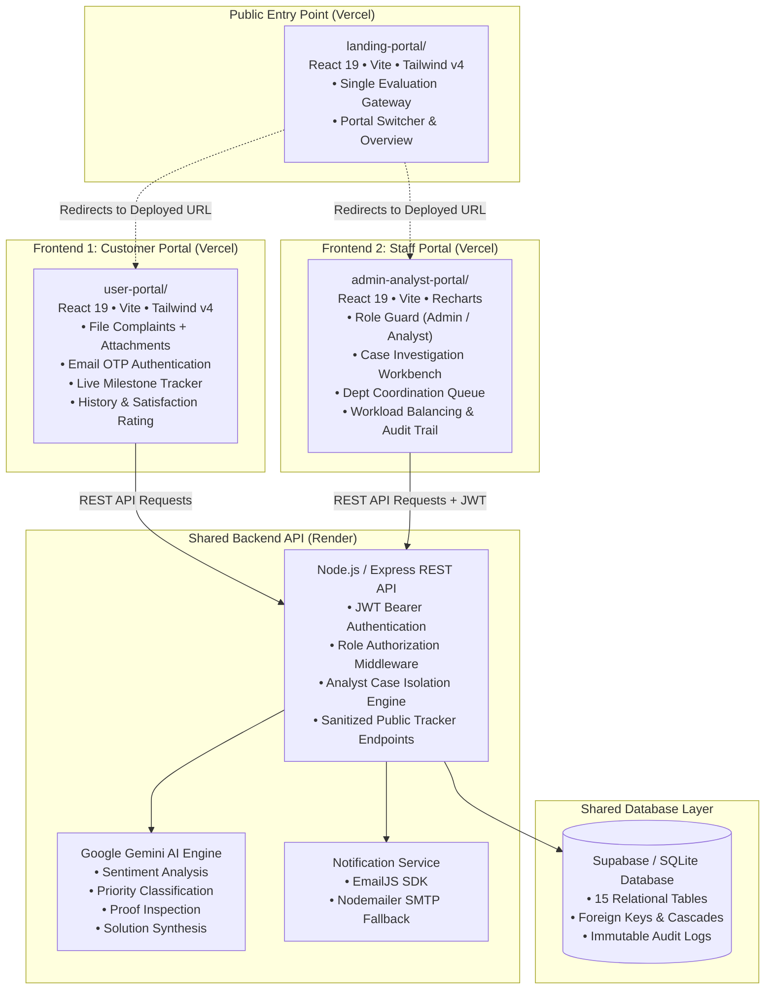
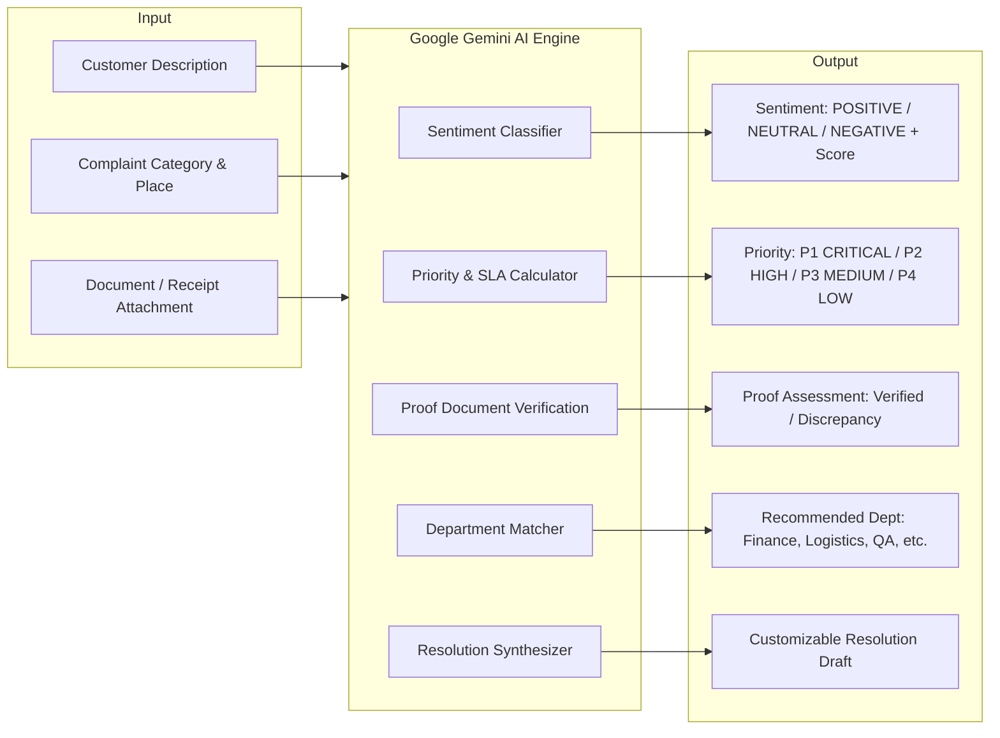

<div align="center">

# 🔄 LOOP — AI-Powered Grievance & Customer Resolution Platform

### *Transforming customer complaints into intelligent, transparent, and trackable resolutions.*

[](https://react.dev/)
[](https://vitejs.dev/)
[](https://tailwindcss.com/)
[](https://nodejs.org/)
[](https://expressjs.com/)
[](https://ai.google.dev/)
[](https://supabase.com/)
[](https://vercel.com/)
[](https://render.com/)

<br />

---

### 🌍 Live Production Deployments

| Component | Target Role | Live URL | Platform |
|:---|:---|:---|:---|
| 🌐 **Main Landing Gateway** | **Single Submission / Evaluation Entry** | [**landing-portal-gupr.vercel.app**](https://landing-portal-gupr.vercel.app) |  |
| 👤 **Customer / User Portal** | Customers & Complainants | [**user-portal-8vee-1.vercel.app**](https://user-portal-8vee-1.vercel.app/) |  |
| 🛡️ **Admin & Analyst Portal** | Case Analysts & System Admins | [**admin-analyst-portal-1.vercel.app**](https://admin-analyst-portal-1.vercel.app/) |  |
| ⚙️ **Shared Backend REST API** | Core Intelligence API Service | [**loop-backend-ahtf.onrender.com**](https://loop-backend-ahtf.onrender.com/api/health) |  |

---

</div>

<br />

## 🎯 Evaluation Entry Point

The hackathon/project evaluation submission allows only **ONE deployed URL**. The **LOOP Landing Portal** acts as the single unified evaluation gateway:

👉 **[Open LOOP Landing Portal](https://landing-portal-gupr.vercel.app)**

```
                          ┌───────────────────────────────┐
                          │      LOOP Landing Portal      │
                          │   (Single Evaluation URL)     │
                          │ landing-portal-gupr.vercel.app│
                          └───────────────┬───────────────┘
                                          │
                 ┌────────────────────────┴────────────────────────┐
                 ▼                                                 ▼
  ┌───────────────────────────────┐                 ┌───────────────────────────────┐
  │         USER PORTAL           │                 │    ADMIN & ANALYST PORTAL     │
  │ user-portal-8vee-1.vercel.app │                 │admin-analyst-portal-1.vercel.app│
  │ • Submit Grievances           │                 │ • Workload-Balanced Assign    │
  │ • Email OTP Verification      │                 │ • AI Decision Support Review  │
  │ • Live Ticket Tracking        │                 │ • Department Proof Requests   │
  │ • Resolution Feedback         │                 │ • Case Resolution Sign-Off    │
  └───────────────────────────────┘                 └───────────────────────────────┘
```

---

## 📖 What is LOOP?

**LOOP** is an enterprise-grade complaint and grievance resolution platform architected to replace opaque customer service channels with a structured, transparent, and auditable resolution operating system.

LOOP connects customers, administrators, specialized case analysts, and concerned organizational departments into a collaborative resolution workflow:

- **Central Landing Portal**: Unified public gateway for all stakeholders.
- **Dedicated Customer Portal**: Frictionless grievance filing, OTP email verification, live milestone tracking, and resolution feedback.
- **Dedicated Admin & Analyst Portal**: Role-guarded operational workspace featuring master queues, workload-aware case assignment, deep investigations, and departmental task routing.
- **AI-Assisted Analysis & Triage**: Automatic sentiment extraction, category scoring, proof document verification, and explicit solution formulation via **Google Gemini AI**.
- **Workload-Balanced Case Assignment**: Prevents operational bottlenecks by tracking active caseload per analyst.
- **Strict Analyst Case Isolation**: Analysts only access grievances assigned to them, maintaining operational confidentiality.
- **Department-Level Investigation & Coordination**: Structured evidence requests and findings reports routed across internal departments (*Finance, Logistics, Billing, QA, Support*).
- **Closed-Loop Resolution & Feedback**: Verified resolutions dispatched to customers with 1–5 star satisfaction rating loops.
- **Audit Logging & Analytics**: Chronological system audit logs, SLA velocity metrics, and executive reporting.

---

## 🌐 Landing Portal

The **Landing Portal** (`landing-portal/`) is the single public gateway for the complete LOOP ecosystem.

### Purpose & Architecture
- **Single Public URL**: Solves evaluation and demonstration requirements where only one live URL can be submitted.
- **Role-Based Navigation**: Features dedicated, prominent launchpads for both the **User Portal** and the **Admin & Analyst Portal**.
- **Zero Secret Exposure**: Operates purely as a client gateway; does not store Supabase service keys, Gemini API keys, or backend secrets.
- **Workflow & Architecture Showcase**: Details the 7-phase resolution lifecycle, system capabilities, and governance principles.
- **Live Deployment**: [https://landing-portal-gupr.vercel.app](https://landing-portal-gupr.vercel.app)

---

## 🖥️ Applications Overview

LOOP is structured into **THREE independent frontend applications** and a **shared backend service**:

```
LOOP/
├── landing-portal/           # GATEWAY: Public Landing & Portal Selector (Port 3005 / Vercel)
├── user-portal/              # FRONTEND 1: Dedicated Customer Portal (Port 3000 / Vercel)
├── admin-analyst-portal/     # FRONTEND 2: Staff Enterprise Workbench (Port 3002 / Vercel)
├── backend/                  # REST API: Shared Node.js/Express Intelligence Engine (Port 5000 / Render)
└── database/                 # DATABASE: 15-Table Relational Schema (Supabase / SQLite)
```

### 1. Landing Portal (`landing-portal/`)
- **Live Deployment**: [**landing-portal-gupr.vercel.app**](https://landing-portal-gupr.vercel.app)
- **Port**: `3005`
- **Role**: Single entry point for evaluators and users to select their workspace.
- **Features**: Enterprise SaaS design, dual portal launch cards, interactive 7-phase workflow timeline, platform capability showcase, security and trust guarantees, responsive navigation drawer, and environment-driven redirection.

### 2. Customer / User Portal (`user-portal/`)
- **Live Deployment**: [**user-portal-8vee-1.vercel.app**](https://user-portal-8vee-1.vercel.app/)
- **Port**: `3000`
- **Role**: Public grievance filing, email verification, and tracking portal.
- **Features**:
  - Customer registration and passwordless Email OTP verification.
  - Multi-attribute complaint submission (category, reason, description, location, document attachments).
  - Real-time milestone progress tracking with sanitized status (`Submitted` ➔ `In Progress` ➔ `Resolved`).
  - Personal complaint history dashboard.
  - Official resolution view with detailed findings.
  - Customer satisfaction feedback form (1–5 stars and resolution completeness review).
  - Customer profile management.

### 3. Admin & Analyst Portal (`admin-analyst-portal/`)
- **Live Deployment**: [**admin-analyst-portal-1.vercel.app**](https://admin-analyst-portal-1.vercel.app/)
- **Port**: `3002`
- **Role**: Operational management workbench for administrators and analysts.
- **Features**:
  - Role-based authentication (Admin vs. Analyst) with OTP password reset.
  - Operational KPI dashboard (active tickets, pending triage, SLA resolution rates).
  - Global complaint master inbox with multi-variable filters.
  - Workload-aware analyst assignment engine.
  - Investigation workbench with Google Gemini AI decision-support triage.
  - Inter-department coordination (formal proof requests and findings report review).
  - AI-assisted empathetic resolution synthesizer.
  - User management (provisioning and capacity management of analysts).
  - Feedback analytics and interactive Recharts visualizations.
  - One-click CSV report export.
  - Chronological system audit logs.

---

## 🏛️ System Architecture



---

## 🔄 Complaint Resolution Workflow

The end-to-end complaint lifecycle follows 19 structured, auditable operational stages:

```
Customer Submits Grievance (with Proof) ➔ Email OTP Verification ➔ Database Storage
➔ Admin Queue Ingestion ➔ AI Decision-Support Triage ➔ Workload-Balanced Assignment 
➔ Analyst Investigation ➔ Department Evidence Coordination ➔ Department Action & Report
➔ Analyst Verification ➔ Resolution Formulation ➔ Official Notification Dispatch 
➔ Live Tracker Update ➔ Customer Feedback (1-5 Stars) ➔ Quality & SLA Analytics
```

```mermaid
flowchart TD
    classDef client fill:#eff6ff,stroke:#3b82f6,stroke-width:2px,color:#1e3a8a;
    classDef ai fill:#f5f3ff,stroke:#8b5cf6,stroke-width:2px,color:#4c1d95;
    classDef staff fill:#f0fdf4,stroke:#22c55e,stroke-width:2px,color:#14532d;
    classDef admin fill:#fff1f2,stroke:#f43f5e,stroke-width:2px,color:#881337;

    subgraph CustomerLifecycle ["👤 Customer Lifecycle (User Portal)"]
        S1[1. Customer submits complaint with details & proofs]:::client --> S2[2. Verify email via OTP]:::client
        S2 --> S3[3. Complaint stored in database with Unique ID]:::client
        S16[16. Complaint status updated on Tracker]:::client --> S17[17. Customer tracks progress online]:::client
        S17 --> S18[18. Customer submits 1-5 star feedback]:::client
    end

    subgraph AITriage ["🤖 AI Intelligence Engine (Decision Support)"]
        S3 --> S4[4. Complaint enters Admin Master Queue]:::admin
        S4 --> S5[5. Gemini AI generates category, sentiment & priority]:::ai
        S5 --> S6[6. AI outputs decision-support indicators]:::ai
    end

    subgraph StaffInvestigation ["🛡️ Staff Operations (Admin & Analyst Portal)"]
        S6 --> S7[7. Admin assigns case based on Analyst workload]:::admin
        S7 --> S8[8. Analyst Isolation enforced (Analyst sees only assigned cases)]:::staff
        S8 --> S9[9. Analyst investigates complaint & evidence]:::staff
        S9 --> S10{10. Dept action required?}:::staff
        S10 -- Yes --> S11[11. Dispatch formal proof request to Dept]:::staff
        S11 --> S12[12. Department investigates & uploads report]:::staff
        S12 --> S13[13. Analyst reviews & verifies departmental response]:::staff
        S13 --> S14[14. Analyst formulates official resolution]:::staff
        S10 -- No --> S14
        S14 --> S15[15. Resolution communicated to customer via email]:::staff
        S15 --> S16
    end

    subgraph GovernanceAnalytics ["📊 Governance & Quality"]
        S18 --> S19[19. Feedback analyzed for organizational service improvement]:::admin
    end
```

### Detailed Workflow Stages:
1. **Submission**: Customer submits grievance with category, description, and optional file attachments.
2. **Verification**: Complainant verifies email address via a 6-digit OTP to prevent spam.
3. **Storage**: Record is persisted in the database with an immutable tracking ID.
4. **Admin Queue**: The complaint enters the central administrative oversight queue.
5. **AI Analysis**: Google Gemini analyzes text for sentiment score, issue classification, and severity.
6. **Decision Support**: AI recommendations serve strictly as decision support for human operators.
7. **Assignment**: Administrator assigns the case to an analyst according to real-time workload capacity.
8. **Analyst Case Isolation**: Strict role boundaries ensure Analyst A cannot access cases assigned to Analyst B.
9. **Investigation**: The assigned analyst reviews customer proof, timeline, and AI triage indicators.
10. **Department Routing**: If cross-functional action is needed, the case is routed to the concerned unit (*Finance, Logistics, Legal, QA*).
11. **Proof Request**: Analyst requests formal clarification, inspection logs, or transaction traces.
12. **Department Report**: The department submits remediation findings and evidence back to the workbench.
13. **Analyst Verification**: Analyst verifies whether the departmental evidence resolves the root cause.
14. **Resolution Formulation**: Analyst crafts the final resolution note (with optional AI synthesis aid).
15. **Customer Dispatch**: Verified resolution is transmitted to the customer via email notification.
16. **Tracker Update**: The public tracking status transitions to `RESOLVED` with complete resolution details.
17. **Customer Tracking**: Customer inspects the resolution on their tracking dashboard.
18. **Feedback Collection**: Complainant rates resolution quality (1 to 5 stars) with qualitative remarks.
19. **Organizational Improvement**: Aggregated ratings feed into administrative quality KPIs and trend reporting.

---

## 🤖 AI & Intelligence Engine (Google Gemini)

LOOP integrates **Google Gemini AI** (`@google/generative-ai`) directly into the backend processing pipeline to transform raw, unstructured grievance text into structured, actionable intelligence.



> **Human-in-the-Loop Guarantee:** AI generates triage scores and suggested drafts, but all investigation decisions, department handoffs, and final resolutions are reviewed and approved by authorized human staff.

---

## 🛡️ Security & Privacy Architecture

```
┌──────────────────────────────────────────────────────────────────────────────────┐
│                         SECURITY & PRIVACY GUARANTEES                             │
├──────────────────────────────────────────────────────────────────────────────────┤
│  ✅ Zero Secrets in Frontend: API keys, Gemini secrets & JWT keys in backend only│
│  ✅ Public Tracking Data Sanitization: Strips internal staff names & private notes│
│  ✅ JWT Token Authentication: Secure signed bearer tokens for staff operations   │
│  ✅ Role-Based Middleware: Route guards for CUSTOMER, ANALYST, and ADMIN         │
│  ✅ Analyst Caseload Isolation: Backend-enforced SQL queries prevent cross-view   │
│  ✅ Bcrypt Password Hashing: 10-round salted hash for staff credentials          │
│  ✅ Ephemeral OTP Lifecycles: Time-bounded verification codes with auto-expiry   │
└──────────────────────────────────────────────────────────────────────────────────┘
```

### Frontend Security Rules:
Frontend applications (`landing-portal`, `user-portal`, `admin-analyst-portal`) **never** contain:
- Gemini Secret API keys
- JWT Secrets
- Supabase `service_role` private keys
- EmailJS private secrets
- Database connection strings

Only safe, publishable environment variables (such as backend API URLs and public portal links) are bundled in frontend builds.

---

## 💻 Technology Stack

```
                                     LOOP STACK
 ┌──────────────────────┬──────────────────────┬──────────────────────┬──────────────────────┐
 │       FRONTEND       │       BACKEND        │       DATABASE       │    AI & SERVICES     │
 ├──────────────────────┼──────────────────────┼──────────────────────┼──────────────────────┤
 │ • React 19.0         │ • Node.js 18+        │ • Supabase Cloud     │ • Google Gemini AI   │
 │ • Vite 6.0           │ • Express 4.19       │ • SQLite (Local sync)│ • EmailJS Browser    │
 │ • Tailwind CSS v4    │ • JWT (jsonwebtoken) │ • 15 Relational tbls │ • Nodemailer SMTP    │
 │ • React Router DOM 7 │ • Bcrypt.js          │ • Foreign key checks │ • Vercel (Frontend)  │
 │ • Lucide React Icons │ • CORS Middleware    │ • Status audit logs  │ • Render (Backend)   │
 │ • Recharts 2.15      │ • Dotenv             │                      │                      │
 └──────────────────────┴──────────────────────┴──────────────────────┴──────────────────────┘
```

---

## 🚀 Local Development Quickstart

Run all four components locally on your machine:

### 1. Prerequisites
- **Node.js**: v18.0.0 or higher ([Download Node.js](https://nodejs.org/))
- **npm**: v9.0.0 or higher
- **Git**

### 2. Clone the Repository
```bash
git clone https://github.com/praveena507/Loop.git
cd Loop
```

### 3. Backend Setup (Port 5000)
```bash
cd backend
npm install
cp .env.example .env
# Configure .env with your GEMINI_API_KEY and SUPABASE credentials
node src/server.js
```
> *Backend runs at `http://localhost:5000`.*

### 4. Landing Portal Gateway Setup (Port 3005)
```bash
# In a new terminal:
cd landing-portal
npm install
npm run dev
```
> *Landing Portal runs at `http://localhost:3005`.*

### 5. Customer / User Portal Setup (Port 3000)
```bash
# In a new terminal:
cd user-portal
npm install
npm run dev
```
> *Customer Portal runs at `http://localhost:3000`.*

### 6. Admin & Analyst Portal Setup (Port 3002)
```bash
# In a new terminal:
cd admin-analyst-portal
npm install
npm run dev
```
> *Admin & Analyst Portal runs at `http://localhost:3002`.*

---

## ☁️ Production Deployment Configuration

| Component | Hosting Platform | Root Directory | Build Command | Output Directory |
|:---|:---|:---|:---|:---|
| 🌐 **Landing Portal** | Vercel | `landing-portal` | `npm run build` | `dist` |
| 👤 **User Portal** | Vercel | `user-portal` | `npm run build` | `dist` |
| 🛡️ **Admin & Analyst Portal** | Vercel | `admin-analyst-portal` | `npm run build` | `dist` |
| ⚙️ **Shared Backend API** | Render | `backend` | `npm install` | `node src/server.js` |
| 🗄️ **Database** | Supabase | `database/schema.sql` | Managed Cloud SQL | Cloud Tables |

---

## 📁 Repository Directory Structure

```
LOOP/
├── landing-portal/                    # GATEWAY: Single Public Evaluation Entry Point
│   ├── src/
│   │   ├── components/                # Navbar, Hero, PortalCards, Workflow, Features, TrustSection, FinalCTA, Footer
│   │   ├── config/                    # portalLinks.js (Central URL routing & validation)
│   │   ├── App.jsx                    # Gateway UI shell
│   │   ├── main.jsx                   # React 19 entry point
│   │   └── index.css                  # Tailwind v4 theme & glassmorphic styling
│   ├── public/                        # favicon.svg
│   ├── package.json                   # Independent gateway package
│   ├── vite.config.js                 # Port 3005 config
│   ├── .env.example                   # Deployment URL variables template
│   └── README.md                      # Gateway documentation
│
├── user-portal/                       # FRONTEND 1: Dedicated Customer Application
│   ├── src/
│   │   ├── components/                # Navbar, Footer, StatusBadge
│   │   ├── context/                   # UserAuthContext (Customer session & email OTP)
│   │   ├── pages/                     # 11 Customer-Facing Views
│   │   │   ├── LandingPage.jsx        # Public showcase & feature overview
│   │   │   ├── ComplaintFormPage.jsx  # Grievance filing with proof upload
│   │   │   ├── EmailVerifyPage.jsx    # 2.5-min OTP countdown verification
│   │   │   ├── ComplaintSuccessPage.jsx # Ticket confirmation with copyable ID
│   │   │   ├── TrackComplaintPage.jsx # Live milestone tracker & official response
│   │   │   ├── UserLoginPage.jsx      # Customer email OTP login
│   │   │   ├── UserRegisterPage.jsx   # Customer signup
│   │   │   ├── UserDashboardPage.jsx  # Personal complaint status cards
│   │   │   ├── ComplaintListPage.jsx  # Complete filterable grievance history
│   │   │   ├── UserFeedbackPage.jsx   # 1-5 stars resolution satisfaction form
│   │   │   └── UserProfilePage.jsx    # Customer verified profile
│   │   ├── services/                  # api.js (Customer client), emailjsService.js
│   │   ├── App.jsx                    # Customer routing pipeline
│   │   ├── main.jsx                   # React 19 entry point
│   │   └── index.css                  # Tailwind v4 light theme styles
│   ├── package.json                   # Independent customer portal package
│   ├── vite.config.js                 # Port 3000 config with backend proxy
│   └── .env.example                   # Safe public environment template
│
├── admin-analyst-portal/               # FRONTEND 2: Staff Enterprise Workbench
│   ├── src/
│   │   ├── components/                # StaffHeader, StaffSidebar (responsive drawer), Badges
│   │   ├── context/                   # AuthContext (JWT bearer tokens & role guard)
│   │   ├── pages/                     # 10 Staff & Administration Views
│   │   │   ├── StaffLoginPage.jsx     # Dual-tab login (Analyst / Admin) + OTP reset
│   │   │   ├── StaffDashboardPage.jsx # Live operational KPIs & SLA velocity
│   │   │   ├── ComplaintInboxPage.jsx # Master case inbox with multi-filters & assigner
│   │   │   ├── ComplaintDetailPage.jsx# Investigation workbench & AI solution generator
│   │   │   ├── DepartmentCoordinationPage.jsx # Inter-department requests & queues
│   │   │   ├── StaffAnalyticsPage.jsx # Interactive volume & sentiment charts
│   │   │   ├── StaffReportsPage.jsx   # CSV report exporter
│   │   │   ├── FeedbackInsightsPage.jsx # Admin customer satisfaction metrics
│   │   │   ├── UserManagementPage.jsx # Admin staff provisioning & capacity view
│   │   │   └── SettingsPage.jsx       # Audit logs & platform settings
│   │   ├── services/                  # api.js (Staff & Admin REST client)
│   │   ├── utils/                     # csvExporter.js
│   │   ├── App.jsx                    # Role-guarded routing pipeline
│   │   ├── main.jsx                   # React 19 entry point
│   │   └── index.css                  # Tailwind v4 dark theme styles
│   ├── package.json                   # Independent staff workbench package
│   ├── vite.config.js                 # Port 3002 config with backend proxy
│   └── .env.example                   # Safe staff environment template
│
├── backend/                           # SHARED BACKEND REST API
│   ├── src/
│   │   ├── config/                    # supabase.js client configuration
│   │   ├── controllers/               # Auth, Complaints, Admin, Dept, Feedback, Verify
│   │   ├── middleware/                # authMiddleware.js (JWT validation & RBAC guards)
│   │   ├── routes/                    # auth, complaint, admin, dept, feedback, report routes
│   │   ├── services/                  # geminiService.js (AI triage), emailService.js
│   │   ├── db/                        # initDb.js, seed.js (SQLite + Supabase sync)
│   │   └── server.js                  # Express HTTP server
│   ├── package.json                   # Backend dependencies (@google/generative-ai, etc.)
│   └── .env.example                   # Safe backend environment template
│
├── database/                          # DATABASE DEFINITIONS
│   ├── schema.sql                     # Core 15-table relational schema
│   ├── initDb.js                      # Table initialization routines
│   └── seed.js                        # Default staff accounts & demo tickets
│
└── README.md                          # Comprehensive project documentation
```

---

## 🔐 Environment Variables Reference

### 1. Landing Portal (`landing-portal/.env.example`)
```env
# Production Portal Deployments
VITE_USER_PORTAL_URL=https://user-portal-8vee-1.vercel.app
VITE_ADMIN_ANALYST_PORTAL_URL=https://admin-analyst-portal-1.vercel.app
```

### 2. User Portal (`user-portal/.env.example`)
```env
# Backend API Base URL
VITE_API_BASE_URL=http://localhost:5000/api

# Public Supabase Client (Public Anon Key ONLY)
VITE_SUPABASE_URL=https://your-project.supabase.co
VITE_SUPABASE_ANON_KEY=your-supabase-publishable-anon-key

# Client-Side EmailJS Dispatch (Optional)
VITE_EMAILJS_SERVICE_ID=your_emailjs_service_id
VITE_EMAILJS_TEMPLATE_ID=your_emailjs_template_id
VITE_EMAILJS_PUBLIC_KEY=your_emailjs_public_key
```

### 3. Admin & Analyst Portal (`admin-analyst-portal/.env.example`)
```env
# Backend API Base URL
VITE_API_BASE_URL=http://localhost:5000/api

# Public Supabase Client (Public Anon Key ONLY)
VITE_SUPABASE_URL=https://your-project.supabase.co
VITE_SUPABASE_ANON_KEY=your-supabase-publishable-anon-key
```

### 4. Backend API (`backend/.env.example`)
```env
PORT=5000
DATABASE_URL=./loop.db

# Security (Confidential)
JWT_SECRET=your_secure_jwt_secret

# AI & Database Services
GEMINI_API_KEY=your_google_gemini_api_key
SUPABASE_URL=https://your-project.supabase.co
SUPABASE_SECRET_KEY=your_supabase_service_role_secret_key

# Email Dispatch
EMAILJS_SERVICE_ID=your_emailjs_service_id
EMAILJS_TEMPLATE_ID=your_emailjs_template_id
EMAILJS_PUBLIC_KEY=your_emailjs_public_key
EMAILJS_PRIVATE_KEY=your_emailjs_private_key
```

---

## 👥 Authors & Project Contributors

- 👨‍💻 **Dineshkumar M**
- 👩‍💻 **Sai Praveena**

---

## 🔗 Project Repository

- **GitHub Repository**: [https://github.com/praveena507/Loop](https://github.com/praveena507/Loop)

---

## 📄 License & Attribution

Distributed under the **MIT License**.

Developed with ❤️ by **Dineshkumar M** & **Sai Praveena** as part of the **LOOP Customer Feedback & Grievance Intelligence Platform**.

<div align="center">
  <sub>Built with React 19, Node.js, Express, Tailwind CSS v4, Google Gemini AI, Supabase & Vercel.</sub>
</div>